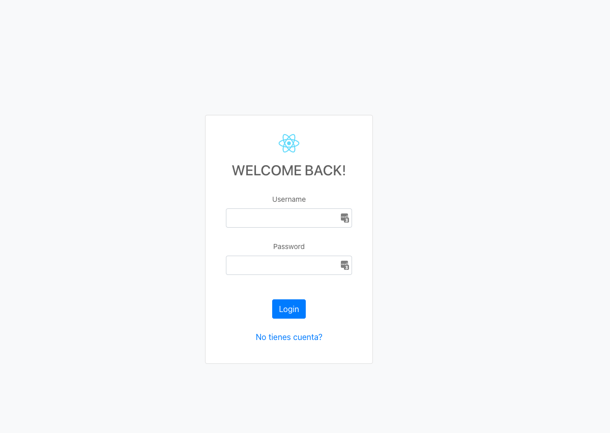
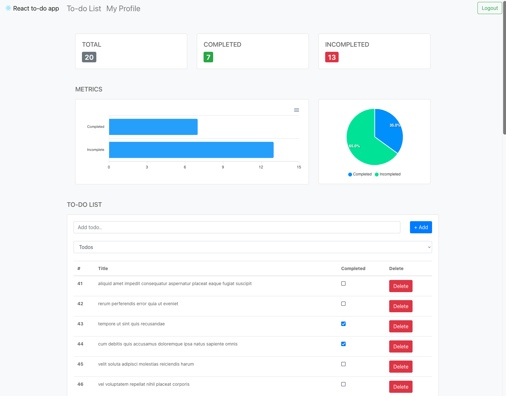

# To-do app (React)

Este repositorio contiene el código fuente de una aplicación de administración de tareas.

### Login screen



### Dashboard screen



## Technologies used :computer:

- [React > v18.x.x](https://reactjs.org/)
- [React router v6](https://reactrouter.com/docs/en/v6)
- [Redux / Redux Toolkit](https://redux-toolkit.js.org/)
- [Bootstrap css only](https://www.npmjs.com/package/bootstrap-css-only)
- [ApexCharts](https://apexcharts.com/react-chart-demos/)

Este proyecto fue creado mediante [create-react-app](https://create-react-app.dev/)

## Prerequisites

- Node - `^v16.0`

## Getting Started

### Install dependencies

```bash
npm install
```

### Initialize the dev server

```bash
npm start
```
